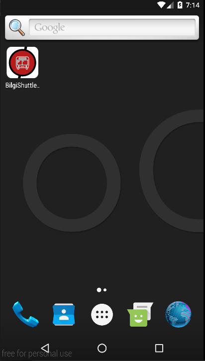
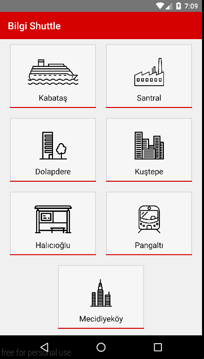

#Bilgi Shuttle Android Application

Basic but useful Android application for listing the shuttle routes and times of İstanbul Bilgi University, built with [React Native](https://facebook.github.io/react-native/).

Data comes from [bilgi-shuttle-api](https://github.com/mdegis/bilgi-shuttle/), processed and shown in this application.

- iOS version: [bilgi-shuttle-ios](https://github.com/bilgishuttle/bilgi-shuttle-ios)
- Web version: [bilgi-shuttle-webapp](https://github.com/bilgishuttle/bilgi-shuttle-web)

##Installation
```bash
# Install node & npm (or update if you have an older version)
https://nodejs.org/

# Clone the repository
$ git clone https://github.com/bilgishuttle/bilgi-shuttle-android.git

# Go to app folder
$ cd bilgi-shuttle-android/BilgiShuttleAndroid

# Run npm install
$ npm install
```

##Usage
```bash
## Open your Android emulator. (We use Genymotion)

## Then run the following command inside project folder.
$ react-native run-android

## Developer menu can be opened by using devices' menu.
```

##Screenshots




##License

	Copyright [2016] [Altay Aydemir]

    Licensed under the Apache License, Version 2.0 (the "License");
    you may not use this file except in compliance with the License.
    You may obtain a copy of the License at

      http://www.apache.org/licenses/LICENSE-2.0

    Unless required by applicable law or agreed to in writing, software
    distributed under the License is distributed on an "AS IS" BASIS,
    WITHOUT WARRANTIES OR CONDITIONS OF ANY KIND, either express or implied.
    See the License for the specific language governing permissions and
    limitations under the License.
